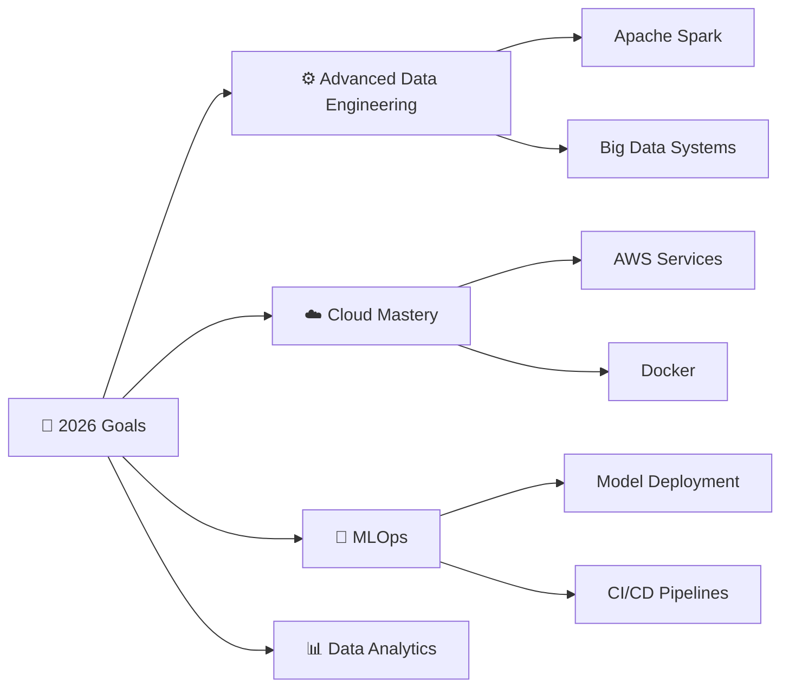

# 👋 Hi there, I'm Muskan Mahalwar!

<div align="center">
  
</div>

<div align="center">
  
</div>

---

## 🌸 About Me

```python
class MuskanMahalwar:
    def __init__(self):
        self.name = "Muskan Mahalwar"
        self.role = "Data Engineer"
        self.location = "Madhya Pradesh, India"
        self.education = "B.Tech Computer Science"
        
    def current_focus(self):
        return [
            "⚙️ Building scalable data pipelines",
            "📊 Working with real-world datasets",
            "🤖 Exploring Machine Learning models",
            "☁️ Learning Cloud & Data Engineering tools"
        ]
    
    def tech_stack(self):
        return {
            "languages": ["Python", "SQL"],
            "data_engineering": ["Apache Spark", "ETL Pipelines"],
            "ml_tools": ["Scikit-learn", "XGBoost"],
            "visualization": ["Power BI", "Tableau"],
            "tools": ["Docker", "Git", "Jupyter"]
        }
```

---

## 🛠️ Tech Stack & Tools

<div align="center">

### 💻 Languages


### ⚙️ Data Engineering


### 📊 Data & ML


### 🧰 Tools


</div>

---

## 🚀 Featured Projects

<div align="center">

### 🔮 Insurance Renewal Prediction

> Built ML model to predict policy renewals
> Used Random Forest & XGBoost
> Evaluated using AUC-ROC

### 📄 Resume Category Prediction App

> Streamlit-based web app for resume classification
> Used TF-IDF + Machine Learning

### 🔄 Data Pipeline Project

> Designed ETL pipeline using Python & SQL
> Processed and cleaned large datasets efficiently

</div>

---

## 📊 GitHub Stats

<div align="center">
  
  
</div>

<div align="center">
  
</div>

---

## 🎯 Current Goals

<div align="center">



</div>

---

## 🤝 Let's Connect!

<div align="center">
  <a href="mailto:your.email@example.com">
    
  </a>
  <a href="your-linkedin-url">
    
  </a>
  <a href="https://github.com/YOUR_USERNAME">
    
  </a>
</div>

---

<div align="center">
  <em>✨ "Turning data into decisions, one pipeline at a time." ✨</em>
</div>

---

<div align="center">
  
</div>

<div align="center">

💖 *Thanks for visiting my profile!*

</div>
